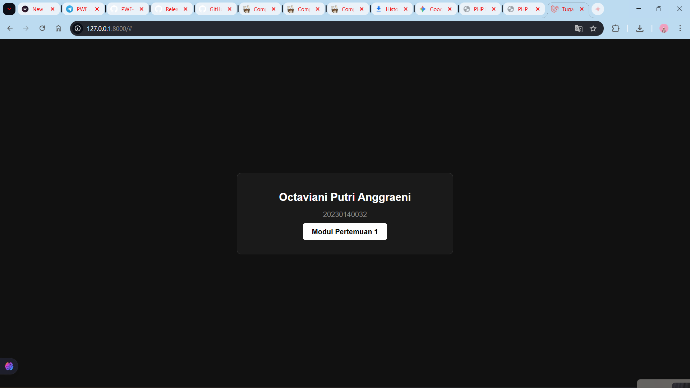

## PRAKTIKUM 1

## PRAKTIKUM 2

## PRAKTIKUM 3
Model

migration

Database

## PRAKTIKUM 5
Produk

edit produk

crud produk

## Praktikum 6

## Praktikum 7

edit detail

hapus detail

## UCP 1
Dashboard

category

add category

Add Product ubah dengan relasi ke Category

